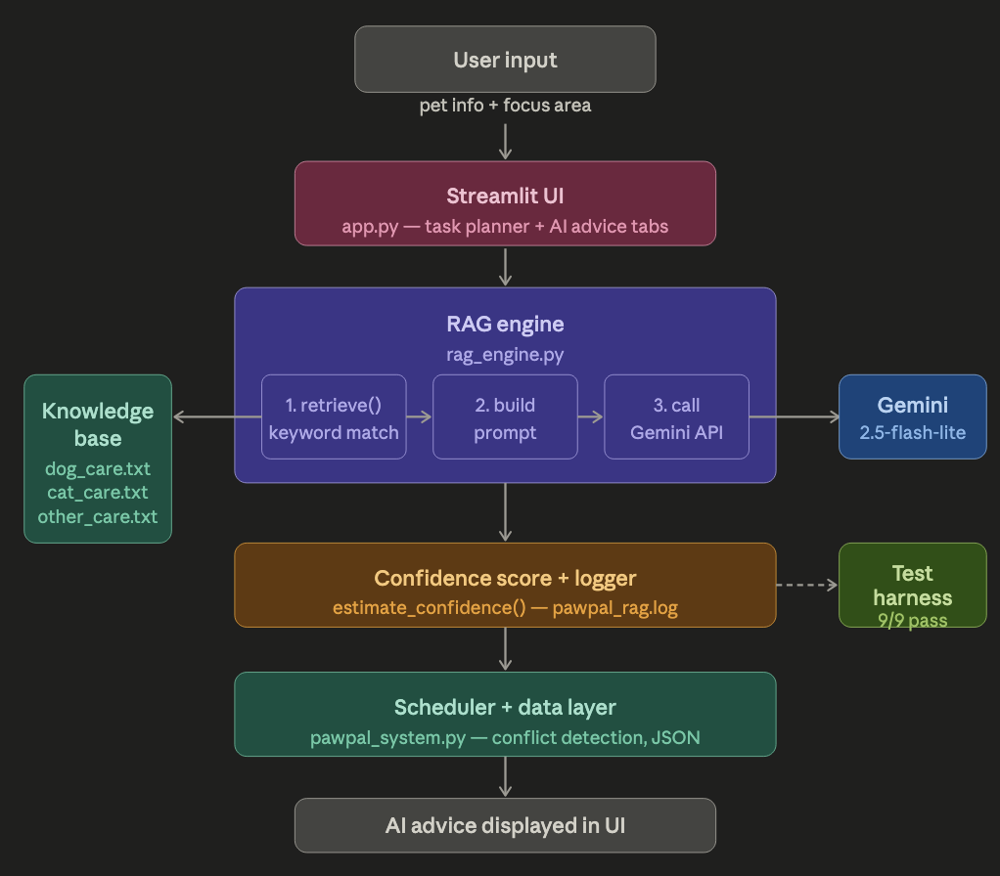

# PawPal+ — AI Pet Care Planner

A Streamlit app that helps pet owners plan daily care routines. I extended my Module 2 project by adding a RAG-powered AI advice engine using the Gemini API.


🎬 [Watch the demo](https://www.loom.com/share/15ca298692d94ec483a22cbcdc6070e7)

---

## Original Project

Built on top of [Module 2: PawPal+](https://github.com/Ondorna/ai110-module2show-pawpal-starter), which had task scheduling, conflict detection, and JSON persistence but no AI. I added a RAG engine that retrieves care knowledge before calling the AI, so advice is grounded in real facts instead of hallucinated.

---

## What it does

- Add and manage pet care tasks (walks, feeding, grooming, etc.)
- Generate a daily schedule with conflict detection
- Get AI advice tailored to your pet's species, age, and existing schedule
- See a confidence score before each AI call
- All RAG calls are logged to `pawpal_rag.log`

---

## Architecture



```
User input → Streamlit UI → RAG engine → Gemini API → advice
                                ↑
                         knowledge_base/
                           dog_care.txt
                           cat_care.txt
                           other_care.txt
```

User picks a pet and focus area. The RAG engine pulls the relevant section from the knowledge base, builds a prompt with the pet's profile and current tasks, and sends it to Gemini. The response shows up alongside the raw retrieved text so you can see exactly what the AI was working from.

---

## Setup

```bash
git clone https://github.com/Ondorna/ai110-module2show-pawpal-starter.git
cd ai110-module2show-pawpal-starter
python -m venv .venv && source .venv/bin/activate
pip install -r requirements.txt
```

Create a `.env` file with your Gemini API key (get one free at [aistudio.google.com](https://aistudio.google.com/apikey)):

```
GEMINI_API_KEY=your_key_here
```

```bash
streamlit run app.py   # start the app
python test_rag.py     # run tests
```

---

## Sample outputs

**Example 1 — Mochi (dog, age 3), Exercise, confidence 100%:**
> "Mochi is a 3-year-old dog — 30–60 minutes of exercise daily is the target. Three walks scheduled is a great start! Consider making one a sniff walk for mental stimulation, adding a 5–15 minute training session, and rotating toys to prevent boredom."

**Example 2 — Luna (cat, age 2), Exercise, confidence 100%:**
> "Luna has a play session scheduled — great! Dedicate 15–30 minutes to active play with a feather wand. Add a climbing structure for stretching, and rotate toys to keep things exciting. Consider adding a puzzle feeder for extra mental stimulation."

**Example 3 — Luna (cat, age 2), General care, confidence 70%:**
> "Feed Luna twice a day, morning and evening. Aim for 15–30 minutes of active play daily. Weekly brushing and ear checks recommended. Schedule an annual vet wellness checkup. Add a dental care session — brushing teeth 2–3 times a week is ideal."

**Confidence score:**
- Dog + exercise + 3 tasks → 100% ✅
- Cat + exercise + 2 tasks → 100% ✅  
- Cat + general + 2 tasks → 70% 🟡

---

## Design decisions

I chose keyword-based retrieval over a vector database because the knowledge base is small and structured — FEEDING, EXERCISE, GROOMING sections match cleanly to user intent without needing embeddings. It's also easier to debug.

I kept `rag_engine.py` separate from `app.py` so I could test retrieval and confidence scoring without spinning up the UI.

The confidence score was my way of making the system's uncertainty visible — if the score is low, the AI has less to work from and the output should be taken with more skepticism.

---

## Testing

```bash
python test_rag.py
# 9/9 tests passed ✅
```

Tests cover file loading, keyword matching, fallback behavior, and confidence scoring. I ran retrieval tests separately from generation so I could confirm the knowledge base was working before debugging API issues.

The biggest hurdle was the Gemini SDK — `google.generativeai` is deprecated and `gemini-2.0-flash` hit free-tier quota limits immediately. I switched to `google-genai` and `gemini-2.5-flash-lite` which resolved both.

---

## Reflection

See [model_card.md](model_card.md) for full reflection on AI collaboration, biases, and testing results.

---

## Project structure

```
├── app.py              # Streamlit UI
├── rag_engine.py       # retrieval + generation + confidence scoring
├── pawpal_system.py    # Owner, Pet, Task, Scheduler
├── test_rag.py         # 9 tests
├── data.json           # persisted data
├── assets              # architecture diagram
└── knowledge_base/
    ├── dog_care.txt
    ├── cat_care.txt
    └── other_care.txt
```

Dependencies: `streamlit`, `google-genai`, `python-dotenv`, `pytest`

---

*CodePath AI110 — Module 5 Final Project*
